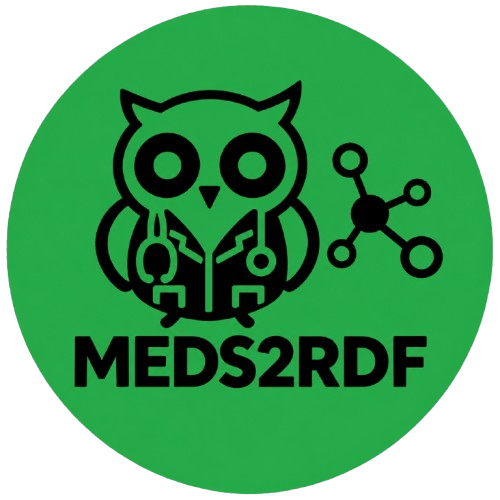

<h1 align="left">
MEDS2RDF
</h1>

<p align="center">
  
</p>

<p align="center">
  
  
  
  
  <a href="https://doi.org/10.5281/zenodo.17953581">
    
  </a>
</p>

**MEDS2RDF** is a Python library for transforming datasets conforming to the **Medical Event Data Standard (MEDS)** into RDF using the **MEDS Ontology**.

The library provides a streaming conversion pipeline for generating RDF triples from large MEDS datasets while separating **data transformation**, **semantic representation**, and **triple storage**. RDF output can be written to an in-memory `rdflib.Graph` or streamed to persistent formats such as N-Triples, including gzip-compressed output.

The software is designed to support both computational workflows and reproducible scientific applications in which MEDS datasets need to be represented as interoperable, machine-readable knowledge graphs.

---

## Key features

### MEDS-to-RDF conversion

MEDS2RDF maps the principal components of a MEDS dataset to RDF representations based on the MEDS Ontology, including:

* dataset metadata;
* clinical events;
* codes and code hierarchies;
* subject splits;
* task labels.

### Streaming architecture

The conversion pipeline processes data in batches rather than materializing the complete RDF graph in memory. This makes the library suitable for large MEDS datasets and enables efficient streaming to persistent sinks.

### Sink-based output

Triple generation is decoupled from persistence through the `TripleSink` abstraction. The same conversion pipeline can therefore target different storage backends without changing the mapping logic.

Provided implementations include:

* `GraphSink` for in-memory RDFLib graphs;
* `NTriplesSink` for streaming N-Triples output;
* gzip-compressed N-Triples output.

### Configurable semantic representation

The `SemanticMode` configuration controls how relationships between subjects and events are represented in the resulting RDF graph:

* `BASE`
* `PARTIAL`
* `FULL`

This allows the same MEDS dataset to be represented with different levels of semantic specificity without changing the underlying data conversion pipeline.

### Typed configuration

The conversion process is controlled through a typed `Config` object and the `MEDSSchema` enumeration, providing an explicit and programmatic interface for selecting exported MEDS components.

---

## Installation

Clone the repository and install the package in editable mode:

```bash
git clone https://github.com/TeamHeKA/meds2rdf.git
cd meds2rdf

pip install -e .
```

For development and testing dependencies:

```bash
pip install -e ".[dev]"
```

### Requirements

MEDS2RDF currently targets Python 3.12.

---

## Architecture

MEDS2RDF separates the conversion workflow into three conceptual layers:

```text
MEDS dataset
     │
     ▼
┌────────────────────┐
│ Data loading        │
└────────────────────┘
     │
     ▼
┌────────────────────┐
│ Mapping functions   │
│ MEDS → RDF triples  │
└────────────────────┘
     │
     ▼
┌────────────────────┐
│ SemanticMode        │
│ BASE / PARTIAL /    │
│ FULL                │
└────────────────────┘
     │
     ▼
┌────────────────────┐
│ TripleSink          │
└────────────────────┘
     │
     ├── GraphSink
     │
     └── NTriplesSink
```

This separation allows mapping logic and semantic representation to remain independent of the final storage mechanism.

The main public components are:

| Component          | Purpose                                       |
| ------------------ | --------------------------------------------- |
| `MedsRDFConverter` | Coordinates the MEDS-to-RDF conversion        |
| `Config`           | Defines export configuration                  |
| `MEDSSchema`       | Selects MEDS dataset components               |
| `SemanticMode`     | Selects the event relationship representation |
| `TripleSink`       | Defines the output interface                  |
| `GraphSink`        | Stores triples in an RDFLib graph             |
| `NTriplesSink`     | Streams triples to N-Triples output           |

---

## Basic usage

The conversion API is centered around a `MedsRDFConverter`, a `TripleSink`, and a `Config`.

```python
from meds2rdf.config import Config, MEDSSchema, SemanticMode
from meds2rdf.converter import MedsRDFConverter
from meds2rdf.sinks.ntriples_sink import NTriplesSink

from pathlib import Path


sink = NTriplesSink(
    Path("output/meds.nt.gz"),
    batch_size=100_000,
    gzip_mode=True,
)

cfg = Config(
    schemas=MEDSSchema.all(),
    batch_size=100_000,
    mode=SemanticMode.BASE,
)

converter = MedsRDFConverter("/path/to/meds_dataset")

converter.convert(
    sink=sink,
    cfg=cfg,
)
```

The converter closes the sink when conversion completes.

---

## Selecting MEDS components

The `MEDSSchema` enumeration defines the MEDS components that can be exported:

```python
from meds2rdf.config import MEDSSchema
```

Available members are:

```text
MEDSSchema.DATASET_METADATA
MEDSSchema.CODES
MEDSSchema.LABELS
MEDSSchema.SPLITS
```

To export all supported components:

```python
cfg = Config(
    schemas=MEDSSchema.all(),
)
```

Alternatively, a subset can be selected explicitly:

```python
cfg = Config(
    schemas={
        MEDSSchema.DATASET_METADATA,
        MEDSSchema.CODES,
    },
)
```

This explicit selection is useful when generating task-specific RDF artifacts or when only a subset of the MEDS representation is required.

---

# Semantic modes

`SemanticMode` controls how event relationships are represented in RDF. The selected mode is specified through `Config`:

```python
from meds2rdf.config import Config, SemanticMode

cfg = Config(
    mode=SemanticMode.FULL,
)
```

The mode changes the semantic relationship connecting an event to its subject while preserving the underlying event representation.

## `SemanticMode.BASE`

`BASE` provides the direct event-subject representation.

For an event associated with subject `subject/1`:

```text
event/1_0 ── meds:hasSubject ──► subject/1
```

This is the default representation.

```python
cfg = Config(
    mode=SemanticMode.BASE,
)
```

The `BASE` representation provides a straightforward and general representation of MEDS events without deriving additional predicates from event codes.

---

## `SemanticMode.PARTIAL`

`PARTIAL` derives a relationship from the top-level component of the MEDS code.

For example, given:

```text
DEMOGRAPHICS//AGE
```

the resulting relationship is conceptually:

```text
subject/1 ── meds:hasDemographics ──► event/1_0
```

The semantic predicate therefore captures the broad event domain while omitting the more specific code component.

```python
cfg = Config(
    mode=SemanticMode.PARTIAL,
)
```

---

## `SemanticMode.FULL`

`FULL` derives the relationship from the complete MEDS code path.

For:

```text
DEMOGRAPHICS//AGE
```

the resulting relationship is conceptually represented as:

```text
subject/1 ── meds:hasDemographicsAge ──► event/1_0
```

This mode provides a more code-specific semantic representation.

```python
cfg = Config(
    mode=SemanticMode.FULL,
)
```

### Semantic-mode comparison

For the MEDS code:

```text
DEMOGRAPHICS//AGE
```

the three representations can be summarized as:

| Mode      | Relationship                              |
| --------- | ----------------------------------------- |
| `BASE`    | `event ── hasSubject ──► subject`         |
| `PARTIAL` | `subject ── hasDemographics ──► event`    |
| `FULL`    | `subject ── hasDemographicsAge ──► event` |

The choice of semantic mode is therefore a representational decision and does not change the underlying MEDS input.

---

## In-memory RDF graphs

For testing, inspection, and smaller datasets, RDF output can be stored directly in an RDFLib `Graph`.

```python
from rdflib import Graph

from meds2rdf.config import Config, MEDSSchema, SemanticMode
from meds2rdf.converter import MedsRDFConverter
from meds2rdf.sinks.graph_sink import GraphSink


graph = Graph()

sink = GraphSink(
    graph,
    batch_size=50_000,
)

cfg = Config(
    schemas={
        MEDSSchema.CODES,
        MEDSSchema.SPLITS,
    },
    batch_size=50_000,
    mode=SemanticMode.BASE,
)

converter = MedsRDFConverter("/path/to/meds_dataset")

converter.convert(
    sink=sink,
    cfg=cfg,
)

print(f"Generated {len(graph)} RDF triples")
```

The resulting graph can then be queried or serialized using RDFLib.

For example:

```python
print(graph.serialize(format="turtle"))
```

---

## Persistent RDF output

For large datasets, streaming output is generally preferable to holding the complete graph in memory.

For example:

```python
from pathlib import Path

from meds2rdf.config import Config, MEDSSchema, SemanticMode
from meds2rdf.converter import MedsRDFConverter
from meds2rdf.sinks.ntriples_sink import NTriplesSink


sink = NTriplesSink(
    Path("output/meds.nt.gz"),
    batch_size=100_000,
    gzip_mode=True,
)

cfg = Config(
    schemas=MEDSSchema.all(),
    batch_size=100_000,
    mode=SemanticMode.FULL,
)

converter = MedsRDFConverter("/path/to/meds_dataset")

converter.convert(
    sink=sink,
    cfg=cfg,
)
```

The resulting N-Triples file can subsequently be imported into an RDF database, triplestore, or other RDF processing environment.

---

## Configuration reference

The conversion process is configured through `Config`:

```python
from meds2rdf.config import Config, MEDSSchema, SemanticMode

cfg = Config(
    schemas=MEDSSchema.all(),
    batch_size=256_000,
    mode=SemanticMode.BASE,
)
```

| Parameter    | Description                                    | Default             |
| ------------ | ---------------------------------------------- | ------------------- |
| `schemas`    | MEDS components to export                      | `set()`             |
| `batch_size` | Number of records processed per mapping batch  | `256_000`           |
| `mode`       | Semantic representation of event relationships | `SemanticMode.BASE` |

The use of a typed configuration object makes conversion settings explicit and reproducible.

---

## Custom output backends

Applications that require a storage backend other than the provided sinks can implement the `TripleSink` interface.

```python
from meds2rdf.sinks.base import TripleSink


class MyCustomSink(TripleSink):

    def add(self, s, p, o):
        ...

    def add_many(self, triples):
        ...

    def flush(self):
        ...

    def close(self):
        ...
```

The custom sink can then be passed directly to the converter:

```python
converter.convert(
    sink=MyCustomSink(...),
    cfg=cfg,
)
```

This design keeps RDF generation independent of the persistence layer.

---

## Performance and scalability

MEDS2RDF is designed around batched processing and streaming output.

For large datasets:

* Prefer `NTriplesSink` over `GraphSink` when the complete graph does not need to be held in memory.
* Consider gzip-compressed N-Triples when storage volume is a concern.
* Tune `batch_size` according to available memory and sink characteristics.
* Use `GraphSink` primarily when direct in-memory graph access is required, such as testing or interactive analysis.

A practical starting point for `batch_size` is between `100_000` and `500_000` records, although the appropriate value depends on dataset characteristics and the target environment.

---

## Reproducibility

For scientific workflows, the conversion configuration should be treated as part of the generated artifact's provenance.

In particular, record:

* the MEDS2RDF version;
* the MEDS dataset version;
* the selected `MEDSSchema` components;
* the selected `SemanticMode`;
* the conversion `batch_size`, where relevant;
* the RDF output format.

For example:

```python
cfg = Config(
    schemas=MEDSSchema.all(),
    batch_size=256_000,
    mode=SemanticMode.FULL,
)
```

Keeping this configuration alongside the generated RDF facilitates reproducibility of downstream analyses and knowledge-graph construction.

---

## Testing

The complete test suite can be executed with:

```bash
pytest
```

Individual test modules can be run directly, for example:

```bash
pytest tests/test_converter.py
```

The test suite covers the conversion and mapping pipeline, including semantic-mode-specific RDF representations.

---

## Migration from earlier versions

Earlier releases exposed conversion options through individual boolean arguments. For example:

```python
converter.convert(
    include_dataset_metadata=True,
    include_codes=True,
    include_labels=True,
    include_splits=True,
)
```

The current API uses a `Config` object:

```python
from meds2rdf.config import Config, MEDSSchema, SemanticMode

cfg = Config(
    schemas={
        MEDSSchema.DATASET_METADATA,
        MEDSSchema.CODES,
        MEDSSchema.LABELS,
        MEDSSchema.SPLITS,
    },
    batch_size=256_000,
    mode=SemanticMode.BASE,
)

converter.convert(
    sink=my_sink,
    cfg=cfg,
)
```

This replaces multiple conversion flags with a single typed configuration and introduces explicit control over semantic representation.

---

## Citation

If you use MEDS2RDF in scientific research, please cite the corresponding software release.

```bibtex
@software{meds2rdf,
  title        = {meds2rdf: Converting MEDS Datasets to RDF Using the MEDS Ontology},
  author       = {{Alberto Marfoglia and Contributors}},
  year         = {2025},
  url          = {https://doi.org/10.5281/zenodo.17953580},
  note         = {Python library for converting MEDS-compliant datasets into RDF}
}
```

Please use the DOI associated with the specific MEDS2RDF release used in your study.

---

## License

MEDS2RDF is distributed under the license specified in this repository.

For source code, releases, issue tracking, and additional documentation, see:

https://github.com/TeamHeKA/meds2rdf
